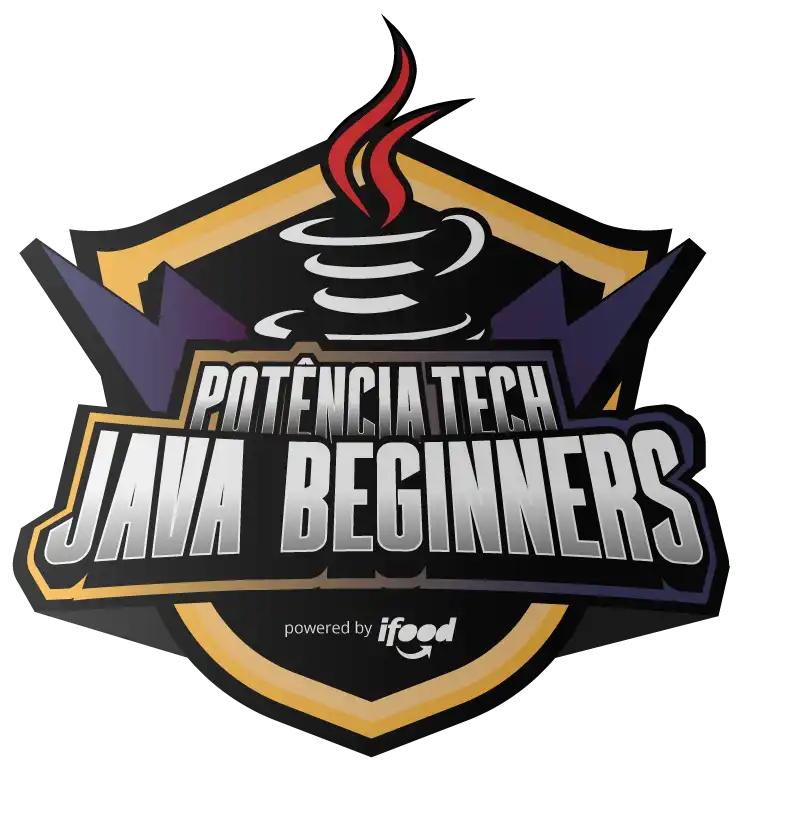

<h1 align="center">
  Potência Tech powered by iFood - Java Beginners
</h1>

<h2 align="center">
  
</h2>

  <a href="#-projeto">🖥️ Projeto</a>&nbsp;&nbsp;&nbsp;|&nbsp;&nbsp;&nbsp;
  <a href="#-tecnologias">🚀 Tecnologias</a>&nbsp;&nbsp;&nbsp;|&nbsp;&nbsp;&nbsp;
  <a href="#-license">📝 License</a>

## 💻 Projeto

Repositório criado para os desafios de códigos da Potência Tech powered by iFood - Java Beginners da DIO.

## 🚀 Tecnologias

Esse projeto foi desenvolvido com as seguintes tecnologias:

- Java

## 📝 License

Esse projeto está sob a licença MIT. Veja o arquivo [LICENSE](LICENSE) para mais detalhes.

---

## 📚 Lista dos Desafios

### Dominando Algoritmos Básicos com Desafios de Código Java

- [Os números são iguais?]()
- [Somando múltiplos]()
- [Uma chamada recursiva]()
- [FizzBuzz]()
- [Busca Sequencial]()

### Dominando Algoritmos Intermediários com Desafios de Código Java

- [Checagem de palíndromo]()
- [Validação de Parênteses]()
- [Quadrados Perfeitos]()
- [Classificando Matrizes](./ClassificandoMatrizes/Main.java)
- [Fatorial Desajeitado]()
- 